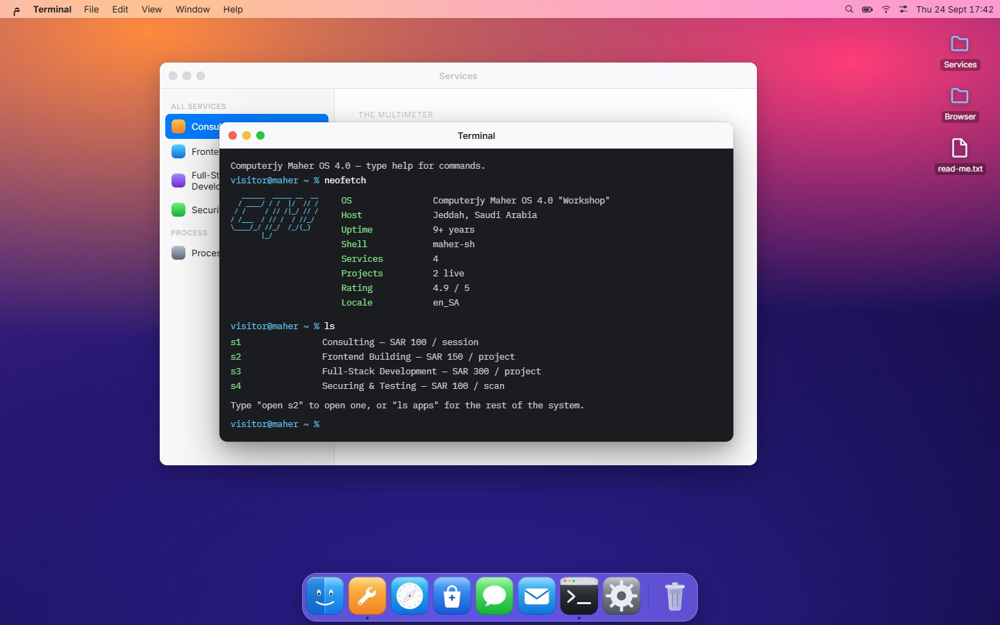
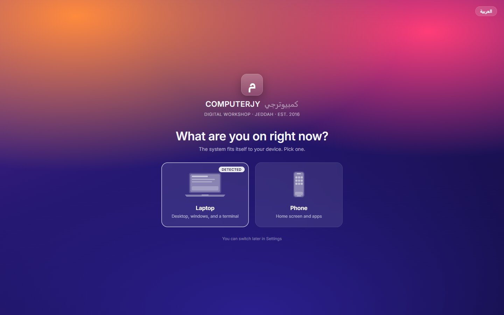
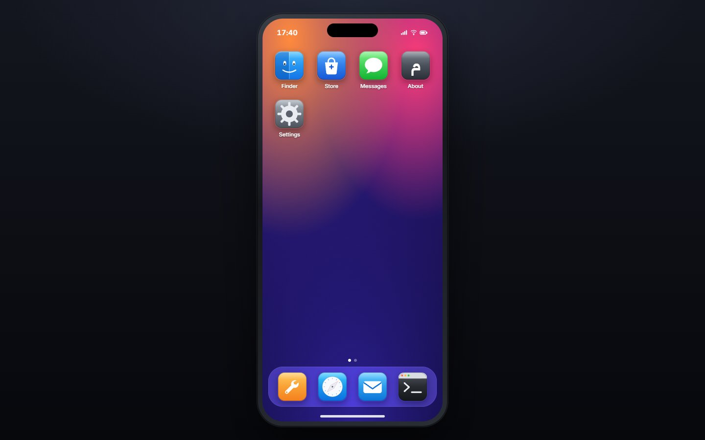

# Computerjy Maher OS — v4 · كمبيوترجي ماهر

**The studio as an operating system.** Fourth design of the mock brand
*Computerjy Maher / كمبيوترجي ماهر* (fake tech store, no backend — a testbed for
front-end pages).

**Live:** https://abdullah2036.github.io/computerjymaherOS/ · jump straight in with [`#mac`](https://abdullah2036.github.io/computerjymaherOS/#mac) or [`#phone`](https://abdullah2036.github.io/computerjymaherOS/#phone)



| The door | The phone shell |
|---|---|
|  |  |

| Version | Idea |
|---|---|
| v1 ([ComputerjyMaher](https://github.com/abdullah2036/ComputerjyMaher)) | 2D cyberpunk / retro-terminal landing page |
| v2 ([computerjymaher3d](https://github.com/abdullah2036/computerjymaher3d)) | First-person WebGL room → monitor portal → showroom (WASD) |
| v3 ([computerjymaherV3](https://github.com/abdullah2036/computerjymaherV3)) | One continuous cinematic scene, scroll-only, camera on rails |
| **v4 (this repo)** | Not a page at all — **a desktop you log into.** The site asks whether you're on a laptop or a phone, boots, and hands you either a macOS-style desktop or an iOS-style home screen. Services are windows. There's a shell. |

The brand identity (name, products, services, bilingual copy, Jeddah / SAR /
"since 2016") is carried **verbatim** from v1 — `src/data/content.js` is the
same file as v3's. Only the *form* changes between versions.

---

## Run

```bash
npm install
npm run dev      # http://localhost:5173
```

```bash
npm run build    # -> dist/  (static, portable, base: './')
npm run preview
```

Node 18+. No 3D, no asset downloads — the whole thing is ~73 kB gzipped.

---

## The idea

A tech studio's website is usually a list of services on a scrolling page. This
one hands you the machine instead. Every section of a normal portfolio becomes
something a computer already has a shape for:

| Normal site section | Here |
|---|---|
| Services / pricing | **Services.app** — a settings-style list, price on the right, Book opens WhatsApp |
| Portfolio | **Browser.app** — each project is a tab with its real URL in the bar |
| Shop / gear | **Store.app** |
| Testimonials | **Messages.app** — reviews as a thread, because a message is believed and a testimonial card isn't |
| Contact form | **Contact.app** — a compose window that sends on WhatsApp |
| About | **About This Machine** — the studio's specs table |
| Sitemap | **Finder** — the whole brand as a filesystem |
| — | **Terminal** — the fast path through all of it |

---

## How it works

### The door
`App.jsx` asks one question before deciding what the site is. It guesses from
`(pointer: coarse)` and viewport width and marks that card "detected", but the
visitor picks. `…/#mac` or `…/#phone` skips the question entirely — useful when
you want to link someone straight at one of the two.

The choice is deliberately **not** persisted: the door is the point, so every
visit gets asked. Preferences (language, wallpaper, dock size, reduced motion)
*are* persisted.

### One kernel, two shells
`src/lib/store.jsx` holds everything the system knows — device, language,
appearance, and the window list — behind one reducer. Both shells drive it
through the same actions, which is why `open('services')` behaves identically
whether it came from the dock, from Spotlight, from double-clicking a file in
Finder, or from typing `open security` in the shell.

```
src/
  lib/store.jsx      the kernel: prefs + window manager
  lib/apps.jsx       the app registry (dock order, phone layout, shell aliases)
  lib/icons.jsx      every icon, drawn as SVG — nothing downloaded
  data/content.js    brand content, carried verbatim from v3
  data/os.js         OS chrome strings (ar/en) + the wallpapers
  boot/              the door, and the boot screen
  desktop/           menu bar · dock · window · Spotlight
  phone/             device frame · home screen · app sheet
  apps/              the nine applications, shared by both shells
  styles/            base · desktop · phone · apps
```

Each app in `apps/` renders **content only** — it takes a `phone` prop and
adapts, but it doesn't know whether it's in a window or a full-screen sheet.
That's what keeps the two machines from drifting apart.

### The window manager
Real dragging and resizing (eight handles), z-order, focus, minimise, zoom,
cascade placement. Drag and resize write straight to the element's style and
only commit to the store on pointer-up — re-rendering a React tree on every
`pointermove` is what makes browser "desktops" feel like slideshows.

### The dock
The magnification is computed from the **resting** layout, never from where the
icons currently are. Measuring live rects looks right for one frame and then
eats itself: a grown icon pushes its neighbour away, the neighbour measures
further from the pointer, so it shrinks — you get one big icon and eight small
ones instead of a wave. Resting centres → raised-cosine falloff → new widths →
new lefts → one clamped shift. The dock's rectangle never changes size; icons
rise out of it.

### The shell
```
help                  every command
ls                    the services, with prices
ls apps|work|store|reviews
open <name>           an app, a service, or a project — `open security`,
                      `open s2`, `open الواجهات`, `open eloria`
cd <name>             same as open
about · process · price <name> · contact
lang <ar|en>          flips the whole system
wallpaper <id>        recolours it
neofetch · whoami · date · pwd · echo · clear · exit · sudo
```
History on ↑/↓, Tab completion on commands and targets, `ctrl-L` to clear.
Aliases are bilingual — `open أمن` resolves the same as `open security`.

The shell runs LTR whatever the interface language, because a prompt that flips
direction stops being a prompt. Arabic output inside it uses
`unicode-bidi: plaintext`, so each line gets its own base direction while the
column stays flush left.

### Bilingual parity
Arabic is default (RTL). The whole OS mirrors: the menu bar, the dock order,
the traffic lights, the sidebars, Finder's columns. Nothing is positioned with
`left`/`right` — it's all logical properties, so the mirroring is structural
rather than a pile of RTL overrides. Copy is written per language, not
translated, exactly as in v3.

### Appearance
Five wallpapers, all pure CSS — nothing to download, and each one recolours the
system. Light appearance throughout: translucent grey chrome, near-black text,
one system blue. `prefers-reduced-motion` is honoured on first paint and can be
toggled in Settings, which disables boot animation, dock magnification, window
transitions and the phone's app-open zoom.

### Keys
`⌘K` / `ctrl-K` Spotlight · `⌘W` close window · `⌘M` minimise · `esc` dismiss ·
right-click the desktop for wallpaper, Terminal and Spotlight.

---

## Not done
- No sound.
- Launchpad, Mission Control, and multiple desktops aren't there — the apps
  fit in one screen, so they'd be furniture.
- The phone is one home-screen page; the second dot is a lie.
- Windows don't snap or tile.
- Verified in Chromium at 1280×720 and in the phone frame. Not yet checked on a
  real handset.

## Notes
Every action that would cost money opens a WhatsApp chat instead. There's no
server, no cart, and no stock — this is a mock brand and a design exercise, and
the About window says so in both languages.

---

Built by **Abdullah Bokhary** · [Portfolio](https://abdullah.pageui.workers.dev/) · [LinkedIn](https://www.linkedin.com/in/abdullah-bokhary-840315326/) · [GitHub](https://github.com/abdullah2036)
